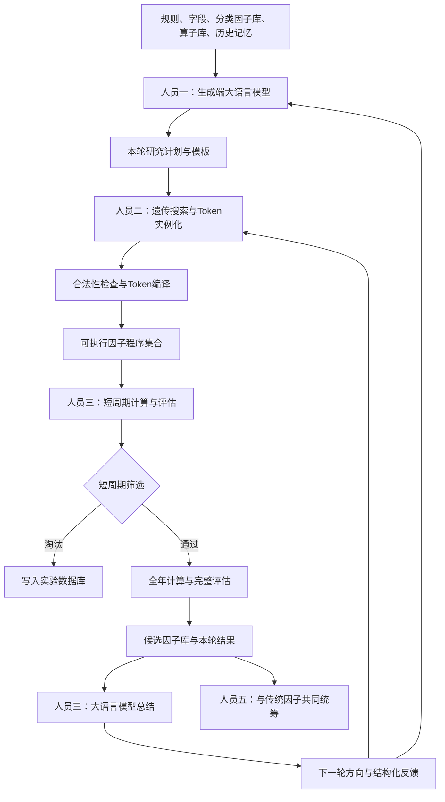
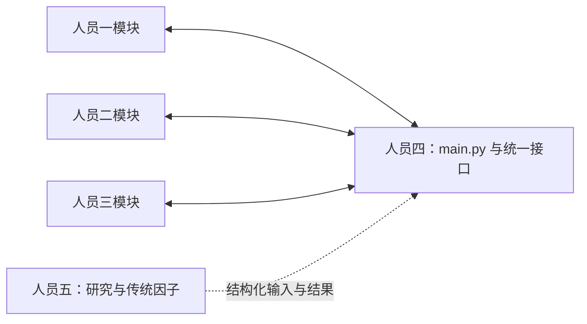

# AI 因子研究系统 Mission Briefing

**版本：** v2.0  
**文档日期：** 2026-07-23  
**文档性质：** 项目唯一核心说明与五人任务简报  
**当前状态：** 总体流程与人员边界已基本确定，若干算法选择和官方接口细节仍待实验确认

---

## 1. 文档定位

本文是 AI 因子研究系统的统一任务说明，覆盖：

- 比赛目标与已知规则；
- 系统设计原则；
- 从生成到评估再到下一轮的完整流程；
- 人员一至人员五的任务重点、接口方向和协作关系；
- 各模块之间的输入输出接口；
- 可以并行启动的开发方式；
- 尚未确定的方案及其决策责任人；
- 工程实现中的重要注意事项。

本文作为项目的唯一核心 Mission Briefing。`docs/`、`configs/` 下的文件仅作为规则证据、配置和技术参考，不再承担另一套总体流程说明。

各环节的未决风险和可选处理方向另见 [风险与待选方案](docs/risks_and_options.md)。该补充文档用于讨论，不代表已经确定的实施方案。

---

## 2. 项目任务

本项目面向量化比赛的 AI 智能因子赛道，目标是建立一套可持续迭代的自动因子研究系统：

```text
读取规则、数据字段、基础因子和算子
→ 大语言模型提出研究方向与因子模板
→ 遗传搜索生成具体候选表达式
→ 将 Token 表达式编译成可执行因子程序
→ 在短周期上快速计算和筛选
→ 对少量通过者进行全年评估
→ 记录结果并维护候选因子库
→ 大语言模型总结本轮结果和下一轮方向
→ 更新搜索策略并进入下一轮
→ 与传统手写因子共同完成最终提交统筹
```

系统不是让大语言模型随意写几个公式，也不是训练一个端到端股票预测模型。系统要让大语言模型、遗传搜索、固定计算程序和回测系统各自承担最适合的职责，并形成可复现、可审计、可以连续迭代的研究闭环。

---

## 3. 已知比赛背景与约束

比赛规则来源见 [BigQuant 竞赛页面](https://bigquant.com/square/competition/76ad3f56-ec2b-431a-890e-139a7f4bbcba)，项目内的整理版本见 [比赛规则摘要](docs/official_rules_summary.md) 和 [规则配置](configs/official_rules.yaml)。若本文与后续更新的官方规则冲突，以官方最新规则为准，并由人员一、四同步修订本文和配置。

### 3.1 数据范围

当前已知的官方数据包括：

- 中证 1000 历史成分股；
- 2019-01-01 至 2024-12-31 的官方数据；
- 分钟级行情和订单簿快照；
- PIT 财务数据；
- 官方允许使用的其他行情、基础因子和衍生字段；
- 2025 年隐藏测试数据不可获得，用于最终评分。

不得将外部新闻、第三方数据库或其他未经允许的数据作为最终因子的计算输入。

论文可以作为研究假设和因子结构的知识来源，但不能借此向最终因子引入官方数据范围之外的数据。

### 3.2 提交要求

最终单因子数据至少包含：

```text
date
instrument
factor
```

当前规则摘要还包括：

- 每次提交对应一个因子；
- 团队最多提交 50 个因子；
- 提交 Notebook 需要包含官方要求的主函数；
- 后台运行环境不能访问互联网；
- 单次后台运行时间上限约为 3 小时；
- 代码必须可执行、可复现，并满足缺失率和未来数据约束。

### 3.3 官方评分

当前整理的官方综合评分为：

```text
final_score = 0.3 × A + 0.7 × B
```

其中：

- `A` 是单因子的加权 RankICIR 表现；
- `B` 是该因子在官方全局 Elastic Net 因子组合中的贡献。

因此，系统既要寻找高质量单因子，也要在后期关注因子之间的重复性和互补性。但相关性不能在搜索早期成为过强惩罚，否则可能过早淘汰同族中真正更强的候选。

### 3.4 风格剥离的已知与未知

官方规则材料显示，最终平台会进行缺失处理、去极值、中位数调整、BARRA 风格中性化、行业中性化和残差化。

目前仍未完全确认的是：研发过程中使用的固定测试端口，是否已经执行了与最终平台完全一致的处理。

因此当前边界为：

- 人员二优先输出原始候选因子值，不在每个因子函数中写死重复的风格剥离；
- 人员三通过统一评估接口执行测试；
- 人员四负责核实研发接口和最终官方接口的处理是否一致；
- 未确认前，相关处理必须集中在评估适配层，避免每个因子各自实现和重复中性化。

---

## 4. 核心设计原则

### 4.1 短周期优先挖掘高质量单因子

短周期阶段的主要目标是发现本身有潜力的候选：

- 关注 IC、ICIR、收益、回撤和极端市场表现；
- 允许多个相似但强弱尚未确定的同族因子继续存在；
- 只排除完全重复或明显非法的表达式；
- 不使用过强的相关性惩罚决定候选生死。

### 4.2 长周期和阶段性维护因子空间

因子相似度、同族替换、最终提交占位和组合互补性，在以下阶段处理：

- 通过短周期筛选以后；
- 候选因子库阶段性维护时；
- 最终 50 个因子统筹时。

具体相似度抽样方法、执行频率和替换规则仍待实验确定。

### 4.3 大语言模型负责研究判断，程序负责确定性执行

大语言模型主要负责：

- 研究计划；
- 模板和假设生成；
- 多指标综合判断；
- 失败和成功模式解释；
- 轮次总结；
- 下一轮方向建议。

程序主要负责：

- Token 解析；
- 表达式生成、交叉和变异；
- 语法、类型和未来数据检查；
- 因子值计算；
- 回测指标计算；
- 缓存、日志和结果存储；
- 确定性的硬规则。

### 4.4 所有实验都必须可追踪

成功和失败都要记录。任意候选因子应能够追溯：

- 来自哪个模板；
- 使用了哪些字段和算子；
- 父代因子是什么；
- 发生了哪些变异；
- 是否有论文或传统因子来源；
- 短周期和全年结果；
- 被保留或淘汰的理由；
- 使用的代码、数据和配置版本。

### 4.5 未确定的算法不提前伪装成定论

以下内容目前必须保留为可替换方案：

- 是否基于经济学和金融论文生成；
- 程序规则和大语言模型的筛选顺序；
- 生成端和评估端是否共享模型与记忆；
- 搜索策略使用人工权重、多臂老虎机还是强化学习；
- 遗传搜索采用单代、多代还是混合搜索；
- 因子相似度和替换机制；
- 研发评估接口的中性化行为。

---

## 5. 核心概念

### 5.1 基础因子、字段和类别

基础输入可以包括价格、收益、成交量、流动性、波动率、订单簿、财务和其他官方字段。

人员一需要将其分类，例如：

```text
价格类
收益类
成交量类
流动性类
波动率类
订单簿类
估值类
盈利质量类
成长类
资金流类
```

分类用于约束大语言模型模板和遗传搜索的槽位，而不是替代具体字段。

### 5.2 算子

算子是对字段或中间结果进行处理的标准操作，例如：

```text
加、减、乘、除
取负
滚动均值
滚动标准差
变化量
滚动相关性
时间序列排序
横截面排序
行业内排序
标准化
条件选择
```

每个算子必须定义：

- 输入数量；
- 输入类型；
- 输出类型；
- 参数范围；
- 计算维度；
- 缺失值处理；
- 是否需要历史窗口；
- 是否允许嵌套；
- 是否存在未来数据风险。

### 5.3 因子模板

模板描述结构族，不一定包含具体字段。

例如：

```text
CS_RANK(
    TS_CORR(
        <收益类字段>,
        DELTA(<流动性类字段>),
        <中周期窗口>
    )
)
```

模板可以包含：

- 纯类别槽位；
- 固定算子和可变字段；
- 固定基础因子和可变窗口；
- 传统强因子的局部可变结构；
- 大语言模型提出的新结构。

### 5.4 具体候选 Token

人员二将模板实例化为具体 Token，例如：

```text
CS_RANK(
    TS_CORR(
        ret_5d,
        DELTA(amount),
        20
    )
)
```

Token 只是结构化表达式，还不是人员三可以直接回测的产物。人员二还必须把它转化为可执行因子程序。

### 5.5 可执行因子程序

可执行因子程序接受评估区间、股票池和数据接口，返回标准因子 DataFrame：

```python
factor_df = factor_program.compute(
    start_date="2024-03-01",
    end_date="2024-03-31",
    universe=universe,
    data_provider=data_provider,
)
```

返回：

```text
date        instrument    factor
2024-03-01  000001.SZ     0.137
2024-03-01  000002.SZ    -0.052
```

人员二交付的是这种“按需计算能力”，不是提前计算好的全年 DataFrame。

### 5.6 遗传搜索

本项目中的遗传搜索是在受约束的因子表达式空间中进行选择、交叉和变异。

可能的动作包括：

- 替换同类字段；
- 更换因子类别；
- 修改滚动窗口；
- 替换类型兼容的算子；
- 改变常数或阈值；
- 交换合法子树；
- 对两个父代进行结构交叉；
- 翻转因子方向。

只有根据评估结果选择父代并影响后续生成时，才构成真正的遗传进化。若只是批量交叉和变异后统一测试，它只是一个遗传式候选生成器。

### 5.7 搜索策略

搜索策略决定计算预算投向哪里，可以同时包括：

- 给生成端大语言模型的研究方向；
- 各模板族的采样比例；
- 字段类别、算子和窗口的采样概率；
- 历史强因子、新模板、传统因子和随机合法结构的配额；
- 探索新方向的最低保留比例；
- 父代选择和变异动作概率。

遗传搜索负责“怎样产生新表达式”，搜索策略负责“优先搜索哪些区域”。

### 5.8 实验数据库与候选因子库

- **实验数据库：** 保存所有合法候选及其生成、计算、评估和淘汰记录。
- **候选因子库：** 保存通过全年评估、达到当前质量要求的高质量因子。
- **传统因子库：** 由人员五统筹，保存团队手写和论文启发的传统因子。
- **最终提交池：** 从自动生成和传统因子两个赛道共同选出的提交候选。

---

## 6. 总体系统架构

### 6.1 业务闭环



### 6.2 代码调用关系

业务上存在：

```text
人员一 → 人员二 → 人员三 → 下一轮人员一
```

代码上不让人员一、二、三互相直接调用。三者都只向人员四暴露标准接口：



人员四负责“接线”，人员一、二、三负责各自业务逻辑。

这样可以避免：

- 模块之间互相引用内部对象；
- 某个人修改实现后迫使其他人同步重写；
- 数据字段和状态含义在不同模块中不一致；
- 测试和调试时难以定位责任。

---

## 7. 四个核心数据接口

接口结构由人员四提出并维护，人员一、二、三共同确认，并可在联调过程中继续调整。

### 7.1 `RoundContext`

人员四交给人员一的本轮上下文，至少包括：

```text
官方规则摘要
字段与基础因子库
基础因子分类
算子目录与限制
上一轮详细总结
候选因子库摘要
搜索策略摘要
本轮计算预算
历史研究记忆
可选的论文输入
```

### 7.2 `GenerationPlan`

人员一输出：

```text
本轮研究假设
新模板及模板槽位
历史强因子修改建议
模板和方向优先级
需要探索和暂时避免的方向
建议的候选来源配额
每个模板的经济逻辑
风险与可能失效条件
```

### 7.3 `CandidateBundle`

人员二输出：

```text
候选因子编号
具体 Token 表达式
可执行因子程序
所需字段
最长历史窗口
模板编号
父代编号
变异记录
来源标签
静态检查结果
预计计算成本
```

其中每个候选都必须提供统一调用能力：

```python
class FactorProgram:
    def compute(
        self,
        start_date,
        end_date,
        universe,
        data_provider,
    ) -> DataFrame:
        ...
```

人员二不需要为每个因子生成独立 Python 源文件。可以采用：

- 通用 Token 解释器加候选 Token；
- 编译后的可调用对象；
- 自动生成的因子函数。

只要对人员三呈现同一调用接口即可。

### 7.4 `EvaluationBundle`

人员三输出：

```text
短周期各区间指标
短周期入选、淘汰和复审结论
短周期筛选理由
全年评估指标
最终保留因子
候选因子库变更
相似度和重复性信息
本轮成功结构
本轮失败模式
下一轮建议
异常和未解决问题
评估端历史记忆更新
```

人员四将其中的下一轮反馈重新写入 `RoundContext` 和搜索状态。

---

## 8. 因子 Token 到真实计算的要求

人员二不能把抽象 Token 原样交给人员三。

例如：

```text
CS_RANK(TS_MEAN(volume, 20))
```

必须被转化为以下真实计算：

1. 对每只股票分别计算 20 期成交量均值；
2. 对每个日期的全部有效股票进行横截面排序；
3. 为每只股票得到当天的排序值；
4. 输出指定区间内的 `date / instrument / factor`。

数学上：

```text
x(i,t) = 股票 i 在日期 t 的过去 20 期成交量均值
f(i,t) = x(i,t) 在日期 t 全部有效股票中的排序值
```

这里不能把横截面排序错误地实现成只输入单只股票的标量函数。不同算子有不同计算维度：

| 算子 | 计算维度 |
|---|---|
| 加、减、乘、除 | 同日期、同股票的值 |
| 滚动均值 | 单股票沿时间计算 |
| 时间序列排序 | 单股票在历史窗口中排序 |
| 横截面排序 | 同日期全部股票之间排序 |
| 行业内排序 | 同日期同一行业股票之间排序 |
| 滚动相关性 | 单股票的两条历史序列 |

人员二需要建立统一算子执行表，例如：

```python
OPERATOR_REGISTRY = {
    "ADD": execute_add,
    "SUB": execute_subtract,
    "MUL": execute_multiply,
    "DIV": execute_divide,
    "TS_MEAN": execute_time_series_mean,
    "TS_RANK": execute_time_series_rank,
    "CS_RANK": execute_cross_sectional_rank,
    "CORR": execute_rolling_correlation,
}
```

每个因子程序还必须：

- 自动识别最长历史窗口；
- 为正式起始日期读取足够的预热数据；
- 只输出正式评估区间；
- 保持股票池和横截面定义一致；
- 不使用未来信息；
- 对除零、无穷值、缺失值和重复行进行处理或报告。

---

## 9. 完整研究流程

### 步骤 0：初始化和一次性准备

准备：

- 官方规则和评分配置；
- 数据接口；
- 字段和基础因子清单；
- 分类因子库；
- 算子库和类型规则；
- Token 表达格式；
- 三个短周期区间；
- 2024 年全年评估配置；
- 实验数据库和候选因子库；
- 大语言模型调用配置；
- 代码、数据和配置版本记录。

### 步骤 1：构造本轮输入

人员四收集：

- 上一轮评估总结；
- 因子库状态；
- 搜索策略；
- 当前预算；
- 人员五提供的可选研究材料；
- 人员一需要的规则、字段、分类和算子。

第一轮没有历史结果，使用空的标准结构，不能临时改变接口。

### 步骤 2：生成端大语言模型提出计划

人员一调用生成端大语言模型，产出 `GenerationPlan`。

模板可以同时来自：

- 新研究方向；
- 历史高质量因子的局部修改；
- 传统因子结构；
- 可选的论文启发；
- 少量随机但合法的方向。

论文是否正式进入生成输入，目前是待定选择，不是既定方案。

### 步骤 3：遗传搜索生成具体候选

人员二：

- 实例化模板；
- 生成具体 Token；
- 执行交叉和变异；
- 保留探索配额；
- 根据上一轮数值反馈调整采样；
- 防止早期少数赢家占满搜索空间。

基础版可以先使用一轮批量生成；多代遗传进化和更复杂搜索后续再实验。

### 步骤 4：静态合法性检查

人员二检查：

- 语法；
- 算子输入数量；
- 字段和类型；
- 参数和窗口；
- 表达式深度；
- 未来数据；
- 完全重复；
- 明显除零或非法数学操作；
- 预计运行复杂度；
- 官方规则限制。

不合法的因子记录失败原因，不交给人员三计算。

### 步骤 5：编译为可执行因子程序

人员二将每个合法 Token 转换为 `FactorProgram`。

人员二在这一阶段主要交付代码和调用能力，不负责提前生成正式短周期或全年结果。实际数据区间、股票池和回测调用由人员三控制；人员四可以在联调时提供模拟输入或测试数据。代码应当为输出列、历史窗口、异常值和运行错误预留统一处理方式，具体检查参数后续再定。

### 步骤 6：短周期计算

人员三对所有候选调用 `FactorProgram.compute()`。

短周期约三个月，包括：

- 一个极端上涨区间；
- 一个极端下跌区间；
- 一个约一个月的普通市场区间。

如果三个区间不连续，可以分区间调用。计算函数负责向前补充历史窗口，但只返回正式测试日期。

### 步骤 7：短周期评估与筛选

人员三计算并整理：

- IC、ICIR；
- 分区间表现；
- 收益和分组表现；
- 最大回撤等风险指标；
- 缺失率；
- 异常值；
- 风格和行业暴露诊断；
- 运行时间；
- 其他官方接口返回指标。

然后由程序规则和大语言模型共同完成筛选。

基础实现建议采用可替换的混合方案：

1. 硬规则淘汰明确非法或明显失败者；
2. 程序化结果保护某些核心指标明显优秀的候选；
3. 大语言模型综合比较剩余候选的多区间表现；
4. 对少量边界候选进行复审；
5. 所有判断都记录理由。

最终顺序和职责比例仍需实验确认。

### 步骤 8：全年计算与完整评估

只有通过短周期筛选的候选，才由人员三再次调用因子程序计算 2024 年全年数据。

这一区分非常重要：

- 人员二提供计算能力；
- 人员三决定在哪个阶段、为哪些因子、计算哪个区间；
- 不提前为全部候选支付全年因子计算成本。

如果短周期位于全年范围内，可以缓存已计算区间，全年阶段只补算缺失日期。但缓存必须绑定因子版本、股票池、数据版本和处理配置。

### 步骤 9：记录与候选因子库更新

所有合法候选进入实验数据库。

通过全年评估的因子进入候选因子库。具体入库门槛、综合评分方式和是否分层入库仍待确定。

短周期阶段不因相关性高直接淘汰强候选；完全等价的重复因子可以提前跳过。

### 步骤 10：轮次总结

人员三的评估端大语言模型读取结构化结果，输出：

- 哪些假设得到支持；
- 哪些模板、字段、算子和窗口有效；
- 哪些方向失败；
- 哪些变异优于父代；
- 哪些异常可能来自市场区间或计算问题；
- 下一轮应继续利用的方向；
- 下一轮应探索的新方向；
- 需要人员一、二、四、五解决的问题。

### 步骤 11：更新搜索方向

下一轮同时得到两类反馈：

- 人员一得到研究总结和下一轮方向；
- 人员二得到父代表现、变异成功率和数值搜索反馈。

搜索策略可以先采用可审计的权重更新或固定探索配额。只有明确设计状态、动作、奖励和策略更新后，才能称为强化学习。

### 步骤 12：阶段性因子空间维护

该步骤在基础闭环跑通后启动，可能包括：

- 对股票和日期进行固定抽样；
- 计算因子值相关性；
- 构建简化相似度指纹；
- 比较结构相似性；
- 识别同族替代关系；
- 在最终提交前减少明显重复占位。

人员三负责测量和结果输出，人员四负责调度，人员五负责最终提交层面的统筹。

### 步骤 13：最终选择和提交

人员五统筹：

- 自动生成因子；
- 传统手写因子；
- 论文启发的传统因子；
- 单因子质量；
- 官方组合贡献潜力；
- 重复性；
- 最终 50 个提交名额。

每个最终因子再转换为官方要求的 Notebook 和主函数格式。

---

## 10. 五人分工

## 10.1 人员一：生成端大语言模型与最外层输入

### 任务定位

人员一负责自动因子系统的开头，决定大语言模型看到什么，以及本轮准备研究什么。

### 主要任务

- 整理比赛规则并转换为模型输入；
- 建立和维护基础因子库；
- 完成基础因子分类；
- 与人员二共同确认算子含义，人员一负责目录和语义定义；
- 设计最外层提示词；
- 测试可用的大语言模型，DeepSeek V4 Flash 可作为候选；
- 设计模型参数和结构化输出格式；
- 接收人员三的本轮总结；
- 生成新模板、历史强因子修改建议和搜索方向；
- 决定新方向和历史强方向在本轮的角色；
- 与人员四、五共同判断是否采用论文驱动生成；
- 与人员四、五研究生成端和评估端的模型、记忆方案。

### 输入

```text
RoundContext
```

### 输出

```text
GenerationPlan
```

### 代码交付

建议核心文件：

```text
generation_agent.py
```

建议接口：

```python
def generate_round_plan(round_context) -> GenerationPlan:
    ...
```

### 不负责

- 不负责批量实例化所有具体公式；
- 不负责 Token 语法修复；
- 不负责因子值计算；
- 不负责正式回测；
- 不单方面决定是否采用论文路线。

### 研究重点

- 大语言模型在自动因子研究中的应用；
- 提示词设计与结构化输出；
- 研究记忆；
- 模型选择和调用成本；
- 论文知识是否能稳定改善模板质量。

---

## 10.2 人员二：遗传搜索、Token编译和因子执行

### 任务定位

人员二负责把人员一的模板和搜索方向变成具体、合法、能够计算的候选因子。

### 主要任务

- 实例化模板；
- 生成具体 Token；
- 实现父代选择、交叉、变异和探索配额；
- 根据上一轮反馈调整搜索参数；
- 建立表达式合法性检查；
- 建立算子执行表；
- 把抽象算子转换成标准库或官方接口中的真实操作；
- 编译 Token 为统一的可执行因子程序；
- 正确处理时间序列和横截面算子；
- 自动处理历史预热窗口；
- 记录父代、模板、变异和可选论文来源标签；
- 向人员四返回 `CandidateBundle`。
- 整理遗传搜索、表达式搜索和高效因子计算方面的文献，为人员一、四提供算法建议。

### 输入

```text
GenerationPlan
SearchState
PreviousEvaluationFeedback
```

### 输出

```text
CandidateBundle
```

### 代码交付

建议核心文件：

```text
factor_search.py
```

内部可以包含：

```text
模板实例化
遗传搜索
Token解析
算子注册表
类型检查
因子执行器
```

建议接口：

```python
def search_and_compile(
    generation_plan,
    search_state,
    previous_feedback,
) -> CandidateBundle:
    ...
```

### 不负责

- 不提前计算所有候选的全年 DataFrame；
- 不决定短周期和全年哪些候选进入下一阶段；
- 不负责大语言模型综合筛选；
- 不把风格剥离分散写死在每个因子里；
- 不单独制定因子库和算子库的研究边界。

### 研究重点

- 遗传算法与表达式搜索；
- 类型约束的交叉和变异；
- 探索与利用平衡；
- 防止赢家通吃；
- 表达式编译和高效批量计算；
- 计算复用与中间结果缓存。

---

## 10.3 人员三：因子评估、筛选与轮次总结

### 任务定位

人员三负责对人员二生成的因子进行分阶段测试，并使用程序和大语言模型完成判断、解释与总结。

### 主要任务

- 接收 `CandidateBundle`；
- 调用每个 `FactorProgram` 生成短周期 DataFrame；
- 使用固定回测接口计算短周期结果；
- 实现硬规则和可替换筛选流程；
- 使用评估端大语言模型进行综合判断或复审；
- 只对入选因子调用全年计算；
- 执行全年完整评估；
- 记录 IC、ICIR、收益、回撤、缺失和极端区间表现；
- 输出相似度和重复性诊断；
- 决定候选因子库的建议变更；
- 使用大语言模型形成轮次总结和下一轮方向；
- 保存评估端历史记忆；
- 向人员四返回 `EvaluationBundle`。

### 输入

```text
CandidateBundle
EvaluationConfig
EvaluationMemory
```

### 输出

```text
EvaluationBundle
```

### 代码交付

建议核心文件：

```text
factor_evaluator.py
```

建议接口：

```python
def evaluate_candidates(
    candidate_bundle,
    evaluation_config,
    evaluation_memory,
) -> EvaluationBundle:
    ...
```

### 不负责

- 不解释或重新编译 Token；
- 不重复实现人员二的算子；
- 不提前要求人员二生成全年 DataFrame；
- 不直接修改人员一和人员二的内部状态；
- 不单方面决定官方接口的中性化假设。

### 研究重点

- 多区间因子评价；
- IC、ICIR、收益和风险的综合使用；
- 程序规则与大语言模型的合理分工；
- 大语言模型判断的稳定性和可审计性；
- 因子相似度和候选池维护；
- 官方评估接口的输出解释。

### 与人员五的协作

人员五掌握传统因子库和最终因子缺口，应帮助人员三判断：

- 当前因子库缺少哪些经济逻辑；
- 哪些自动因子只是重复传统因子；
- 哪些筛选结果需要进一步解释；
- 最终提交池需要哪些互补方向。

---

## 10.4 人员四：主流程、接口与系统集成

### 任务定位

人员四负责项目最外层代码框架和全流程调试，是人员一、二、三之间唯一的代码连接者。

### 主要任务

- 编写研究流程总控程序；
- 提出并维护核心数据结构；
- 为人员一、二、三提供模拟输入和接口测试；
- 调用生成、搜索、评估模块；
- 将人员三的反馈送入下一轮人员一和人员二；
- 管理配置、日志、版本和异常；
- 管理实验数据库、候选因子库和缓存；
- 支持中断恢复和单轮重跑；
- 检查输入输出字段、类型和版本；
- 统计数据读取、因子计算、中性化、IC 和回测耗时；
- 核实官方研发接口的风格剥离行为；
- 适配最终官方 Notebook 和主函数格式；
- 与人员一、五研究论文路线和模型记忆方案；
- 与人员五搜集和解释整体 AI 投研流程相关论文。

### 代码交付

项目根目录暂定使用：

```text
main.py
```

它表示“研究系统总控程序”。

为了避免与最终单因子提交主函数混淆，建议目录上进行隔离：

```text
main.py                              # 研究系统总控
submissions/<factor_id>/notebook.ipynb
submissions/<factor_id>/factor_code.py
```

人员四还可维护：

```text
schemas.py
config.py
adapters.py
storage.py
```

### 主流程接口

```python
def run_round(round_context):
    generation_plan = generation_agent.generate_round_plan(
        round_context
    )

    candidate_bundle = factor_search.search_and_compile(
        generation_plan=generation_plan,
        search_state=round_context.search_state,
        previous_feedback=round_context.previous_feedback,
    )

    evaluation_bundle = factor_evaluator.evaluate_candidates(
        candidate_bundle=candidate_bundle,
        evaluation_config=round_context.evaluation_config,
        evaluation_memory=round_context.evaluation_memory,
    )

    save_round_results(evaluation_bundle)
    return build_next_round_context(evaluation_bundle)
```

### 不负责

- 不替人员一决定研究方向；
- 不替人员二设计遗传算法细节；
- 不替人员三决定因子优劣；
- 不把所有业务逻辑堆入 `main.py`；
- 不成为所有任务必须等待的人工审批节点。

### 研究重点

- AI 因子系统总体架构；
- 大语言模型代理的记忆与协作；
- 工作流编排；
- 数据和接口版本管理；
- 官方环境适配；
- 可复现、缓存和故障恢复。

---

## 10.5 人员五：文献研究、传统因子和最终统筹

### 任务定位

人员五负责传统因子赛道、研究支持和最终因子组合统筹，不承担自动生成主流程中的核心 Python 模块。

### 主要任务

#### 传统因子

- 汇总所有成员提出的手写传统因子；
- 记录传统因子的来源、逻辑、公式和测试结果；
- 负责传统因子的检验和提交统筹；
- 分析传统因子目前覆盖和缺少的方向；
- 向团队反馈下一批传统因子挖掘重点。

#### 文献与智囊支持

- 搜集经济学和金融学论文；
- 搜集大语言模型、遗传搜索和 AI 投研流程相关论文；
- 将论文整理成结构化摘要，而不是只保存链接；
- 与人员一、四共同决定是否采用论文驱动生成；
- 如果采用，维护论文库和可供人员一使用的研究输入；
- 向人员三提供传统因子覆盖和最终因子缺口信息；
- 与人员四共同跟踪总体研究进度和跨模块问题；
- 为整个团队提供方法改进建议。

#### 最终因子统筹

- 综合自动生成和传统因子两个赛道；
- 统筹最终 50 个提交名额；
- 识别重复因子和逻辑空白；
- 协调最终测试、提交顺序和结果记录；
- 形成阶段性研究进度和下一步建议。

### 可能形成的工作成果

人员五不强制交付自动主流程 `.py` 文件。其具体记录方式和工作成果由后续协作决定，可能包括传统因子记录、论文资料与摘要、因子方向分析、阶段性研究建议以及最终提交候选清单。

必要时可提供：

```text
submission_exporter.py
```

用于把最终因子批量转化为提交格式，但这不是人员五的主要工作。

### 不负责

- 不单独决定论文路线；
- 不直接修改人员一、二、三的核心模块；
- 不代替人员三进行自动因子日常短周期筛选。

---

## 11. 人员之间的责任关系

| 事项 | 主要负责人 | 协作人员 | 最终落地 |
|---|---|---|---|
| 官方规则整理 | 人员一、四 | 人员五 | 人员四写入配置和接口 |
| 基础因子库与分类 | 人员一 | 人员二、五 | 人员一维护，人员四定义格式 |
| 算子目录与语义 | 人员一 | 人员二 | 人员二实现，人员四定义接口 |
| 生成端模型和提示词 | 人员一 | 人员四、五 | 人员一 |
| 是否采用论文驱动 | 人员一、四、五共同决定 | 人员二、三提供意见 | 人员一的输入模块 |
| 遗传搜索 | 人员二 | 人员一、四 | 人员二 |
| Token合法性和编译 | 人员二 | 人员一、四 | 人员二 |
| 短周期和全年评估 | 人员三 | 人员四、五 | 人员三 |
| 程序规则与模型筛选 | 人员三 | 人员一、四、五 | 人员三提供可替换实现 |
| 风格剥离接口确认 | 人员四 | 人员三 | 人员四 |
| 轮次总结 | 人员三 | 人员一、五 | 人员三 |
| 搜索反馈更新 | 人员二 | 人员一、三、四 | 人员二维护数值状态 |
| 模型记忆方案 | 人员一、四、五 | 人员三 | 人员四实现 |
| 传统因子统筹 | 人员五 | 全体成员 | 人员五 |
| 因子空间维护 | 人员三、五 | 人员四 | 人员四调度 |
| 最终 50 因子统筹 | 人员五 | 全体成员 | 人员五 |
| 全流程集成 | 人员四 | 人员一、二、三 | 人员四 |

---

## 12. 并行关系与衔接方式

人员一、二、三的核心工作可以并行展开，不必等待完整上游模块完成：

- 人员一可以先研究模型、提示词、规则输入、因子分类和模板格式；
- 人员二可以先设计遗传搜索、Token 表达、算子调用和可执行因子程序；
- 人员三可以先围绕既有回测接口研究短周期、长期评估、筛选和总结；
- 人员四可以同步搭建总控框架，并在接口尚未完全确定时提供模拟输入输出；
- 人员五可以并行处理传统因子、论文和整体研究支持。

人员二和人员三虽然前后相接，但二的核心代码可以用模拟 `GenerationPlan` 开发，三的核心代码也可以用固定因子函数或模拟 `CandidateBundle` 开发。人员四需要逐步统一这些模块的格式，但接口的具体字段和技术实现仍可在联调中调整，不要求现在一次定死。

建议优先确认的是信息能否顺利流转，而不是提前规定完整开发阶段、最小算子数量或最终验收门槛。

---

## 13. 当前待定事项

### 13.1 是否使用论文驱动生成

备选方案：

- **方案 A：** 第一版完全不输入论文，只使用规则、字段和传统知识；
- **方案 B：** 论文只用于提出经济假设和模板，不直接生成具体因子；
- **方案 C：** 为论文模板、历史强因子和纯创新模板设置并行配额。

决策人：人员一、四、五。

### 13.2 短周期筛选中程序和大语言模型的分工

备选方案：

- 硬规则初筛，大语言模型负责主要综合判断；
- 程序评分负责主要筛选，大语言模型只复审边界淘汰者；
- 混合方案：硬规则、核心指标保护、大语言模型综合判断和少量复审。

决策人：人员三主导，人员一、四、五参与实验比较。

### 13.3 生成端和评估端是否共用模型与记忆

备选方案：

- 同一个模型和同一套长期记忆；
- 两个独立模型和两套独立记忆；
- 两个角色各自保留记忆，只通过结构化 `RoundReview` 交换必要信息。

第三种方案角色边界较清楚，但仍需实验确认。

决策人：人员一、四、五，人员三提供评估端需求。

### 13.4 遗传搜索深度

备选方案：

- 一轮只进行一次批量生成、短评估和父代更新；
- 一轮内部运行多代；
- 模板枚举、局部变异和遗传搜索混合。

三种方案目前均保留，具体采用哪一种由人员二结合后续计算条件和实验结果决定。

决策人：人员二，人员四根据计算预算提供约束。

### 13.5 搜索策略算法

备选方案：

- 固定配额与人工权重；
- 根据历史成功率更新权重；
- 多臂老虎机式搜索；
- 完整强化学习；
- 大语言模型文字方向与程序数值权重并行。

是否引入强化学习目前不预设结论。

决策人：人员二主导，人员一、三、四提供输入。

### 13.6 因子空间维护

待确定：

- 抽样股票和日期的方法；
- 因子值相关性还是结构相似度；
- 每轮还是阶段性执行；
- 高相关因子是标记、降权还是替换；
- 最终提交中同族因子的最大占位。

决策人：人员三、五主导，人员四实现调度。

### 13.7 官方评估接口

待确认：

- 研发测试端口是否自动完成行业和 BARRA 风格剥离；
- 短周期和最终测试的处理是否一致；
- 收益、IC 和评分对应剥离前还是剥离后数据；
- 官方主函数准确签名；
- 最终提交代码如何从内部 `FactorProgram` 转换。

决策人：人员四主导，人员三协作。

---

## 14. 重要工程注意事项

### 14.1 不要提前生成全部全年因子值

人员二交付计算函数，人员三按阶段调用。

如果为所有候选提前计算全年数据，短周期漏斗只能节省回测成本，不能节省因子计算成本。

### 14.2 需要测量时间花在哪里

人员四统一记录：

```text
数据读取耗时
因子值计算耗时
风格剥离耗时
IC和ICIR计算耗时
收益回测耗时
大语言模型调用耗时
缓存命中率
```

不能在没有测量前假定瓶颈一定是回测或因子计算。

### 14.3 横截面算子不能按单股票独立调用

横截面排序、标准化、行业内排序等操作必须获得当天相应股票集合。股票池定义必须作为计算上下文的一部分。

### 14.4 缓存必须绑定版本

缓存键至少包含：

```text
factor_id
factor_version
token_hash
start_date
end_date
universe_version
data_version
operator_version
preprocessing_version
```

### 14.5 大语言模型不能接收未经整理的海量原始结果

人员三先用程序生成结构化摘要，再交给大语言模型。模型输出必须是可解析结构，并保留原始响应用于审计。

### 14.6 不要重复中性化

官方处理未确认前，风格剥离集中在评估适配层。若官方接口已经处理，不应在候选函数中再次处理。

### 14.7 强化学习名称必须与实际算法一致

仅仅“下一轮根据上一轮结果调整”不等于强化学习。只有明确状态、动作、奖励和策略更新，才使用这一名称。

### 14.8 论文材料接入系统时的可能格式

如果后续决定让论文材料进入生成或评估流程，可以考虑整理以下信息：

```text
研究问题
数据和市场
核心结论
可映射的官方字段
可用因子结构
潜在失效条件
是否允许进入最终计算
建议交给哪个模块
```

### 14.9 `main.py` 与提交主函数分目录隔离

项目根目录的 `main.py` 是研究总控。最终提交 Notebook 和因子主函数放入单独的 `submissions/` 目录，不通过文件名本身区分职责。

---

## 15. 建议目录结构

```text
.
├── README.md                         # 本 Mission Briefing
├── main.py                           # 人员四：研究流程总控
├── schemas.py                        # 人员四：统一数据结构
├── config.py                         # 人员四：配置加载
├── generation_agent.py               # 人员一
├── factor_search.py                  # 人员二
├── factor_evaluator.py               # 人员三
├── configs/
│   ├── official_rules.yaml
│   ├── factor_library.yaml
│   ├── operator_library.yaml
│   └── evaluation_periods.yaml
├── prompts/
│   ├── generation_prompt.md
│   └── evaluation_prompt.md
├── memory/
│   ├── generation_memory.json
│   └── evaluation_memory.json
├── storage/
│   ├── experiments/
│   ├── candidate_pool/
│   └── cache/
├── research/
│   ├── papers/
│   ├── paper_summaries/
│   └── traditional_factors/
├── submissions/
│   └── <factor_id>/
│       ├── notebook.ipynb
│       └── factor_code.py
└── tests/
    ├── test_generation_interface.py
    ├── test_factor_program.py
    ├── test_evaluation_interface.py
    └── test_full_round.py
```

该结构仅是当前参考。人员四和各模块负责人可根据实际代码组织方式调整，不要求现在建立全部目录或预先确定算子数量。

---

## 16. 系统级伪代码

```python
def run_research(initial_context, stop_condition):
    context = initial_context

    while not stop_condition(context):
        # 人员一：生成本轮研究计划
        generation_plan = generate_round_plan(context)

        # 人员二：搜索具体候选并编译为可执行因子程序
        candidate_bundle = search_and_compile(
            generation_plan=generation_plan,
            search_state=context.search_state,
            previous_feedback=context.previous_feedback,
        )

        # 人员三：短周期评估
        quick_results = evaluate_quick_periods(
            candidate_bundle=candidate_bundle,
            quick_periods=context.quick_periods,
        )

        # 人员三：规则和大语言模型共同筛选
        quick_decision = make_quick_decision(
            quick_results=quick_results,
            selection_policy=context.selection_policy,
        )

        # 人员三：只计算并评估短周期通过者
        full_results = evaluate_full_period(
            candidates=quick_decision.selected_candidates,
            full_period=context.full_period,
        )

        # 人员三：记录、入库和轮次总结
        evaluation_bundle = finalize_round(
            generation_plan=generation_plan,
            quick_results=quick_results,
            quick_decision=quick_decision,
            full_results=full_results,
        )

        # 人员四：保存并构建下一轮上下文
        save_round_artifacts(evaluation_bundle)
        context = build_next_round_context(
            previous_context=context,
            evaluation_bundle=evaluation_bundle,
        )

    # 人员五统筹两个赛道的最终候选
    return build_final_submission_pool(
        generated_factor_pool=context.generated_factor_pool,
        traditional_factor_pool=context.traditional_factor_pool,
    )
```
